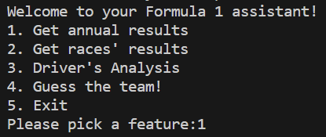
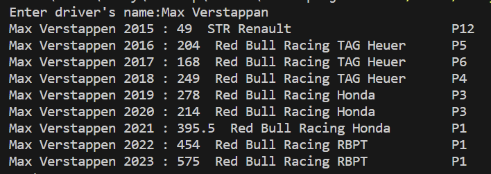
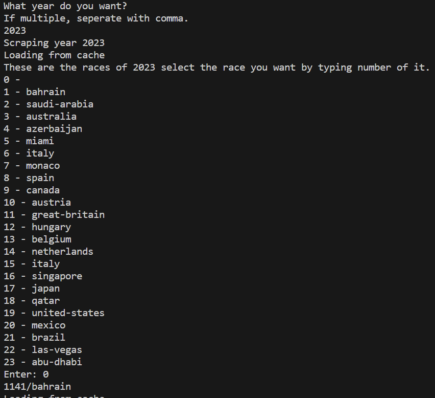
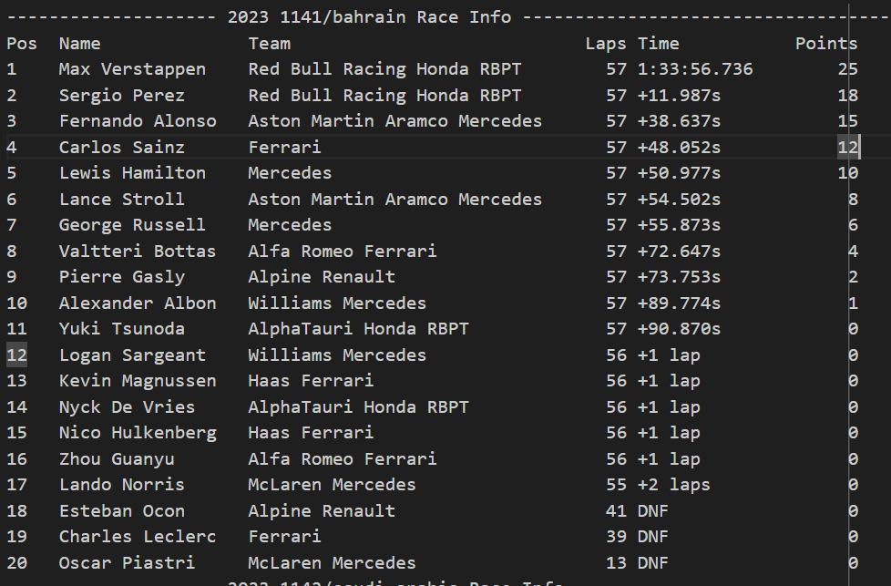
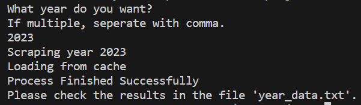
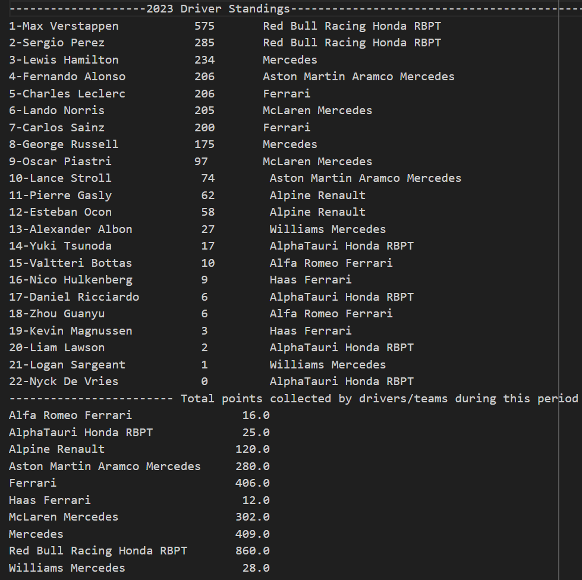
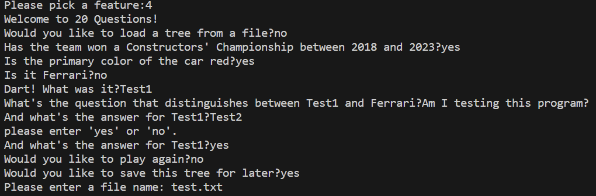

# final project check point

## Project code

* Link: https://github.com/pontiff701/F1-data-assistant
* Packages: `requests`, `BeautifulSoup`, `time`, `json`, `random`, `numpy`

## Data Sources

* All data are come from the Formula 1 official website: https://www.formula1.com/en.html

    - All race name are come from: https://www.formula1.com/en/results.html/[input_your_year_here]/races.html
    - All race results are come from: https://www.formula1.com/en/results.html/[input_your_year_here]/races/[input_the_race_name_here]/race-result.html
    - All annual driver information are come from: https://www.formula1.com/en/results.html/[input_your_year_here]/drivers.html  
    - All annual team information are come from: https://www.formula1.com/en/results.html/[input_your_year_here]/team.html

* Each website we called in the program will be stored as a json cache file: `cache_drivers.json`, `cache_results.json`, and `cache_teams.json`. The driver's information will be stored in a LiteSQL file `sqlData.txt` from `driverInfo.py`.
* All results will be stored as a txt file.

* The project scripts access Formula 1 data primarily through web scraping techniques, using Python libraries such as `requests` and `BeautifulSoup`.

    - **requests**: Utilized for making HTTP requests to the official Formula 1 website, fetching web pages that contain data about drivers, teams, and race results.
    - **BeautifulSoup**: Employed to parse and extract the required data from the retrieved HTML content. It facilitates efficient navigation of the HTML structure, enabling specific data extraction.

* The data encompasses driver and team statistics, race schedules, results, and standings. Each script targets specific data types:
    - `driverInfo.py` - Focuses on individual driver statistics, using cahce file `cache_drivers.json`.
    - `team.py` - Extracts team-related data, using cahce file "cache_team.json".
    - `raceInfo.py` - Gathers detailed information on races, using cahce file "cache_results.json".
    - `personalAnalysis.py` - Analyze each driver's performance, using cache file  from `sqlData.txt`
* Till the end of 2023, I have the data of all drivers and races from 1950 to 2023 seasons, and the data of all teams from 1958 to 2023 sesons.
    - The driver data include their name, team, and total points got in each season.
    - The team results includes the total points of each team got in each season or each peorid we selected.
    - The race results includes all driver's standings, lap time, and the points they obtained in each race.

## Data Structure

* In this program, the data is organized into structured formats suitable for analysis and read. Python data structures such as dictionaries and lists are used to store and manipulate the data. The project structures data in a way that facilitates easy access and analysis of specific aspects like driver performance and team standings.
* All race results & team performace will be summarized and output into a txt file. All driver's performance data will be analyzed and stored into a txt file.

* some screenshots of the current features:
    - 
    - 
    - 
    - 
    - 
    - 
    - 
## Interaction and Presentation Plans

* The user will be asked to select the features at the first, including get the driver's data, get the race's result, get the team's data, and play the 20 questions game.
    - For the firt three functions, the users will be asked to enter the year, select the race, or enter the driver's name to get the information they need.
    - For the game, the users will be asked if they want to load a existed tree. Then, during the game, they will only need to enter yes or no for the questions. If the program don't know the answer, user will be asked to enter the correct answer and question to match this answer. The game can also study the user's answer and save it into a txt file for the next play.

* The program will mainly using command line prompts for the interactive options and presentation.

## Demo Video

* Link: https://youtu.be/_bLmWmwvFMU